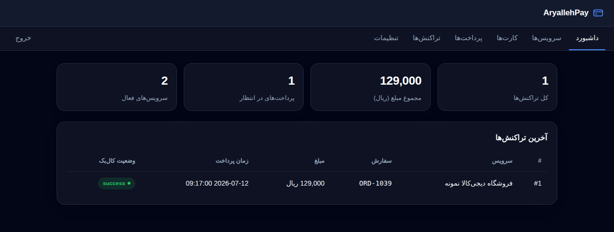
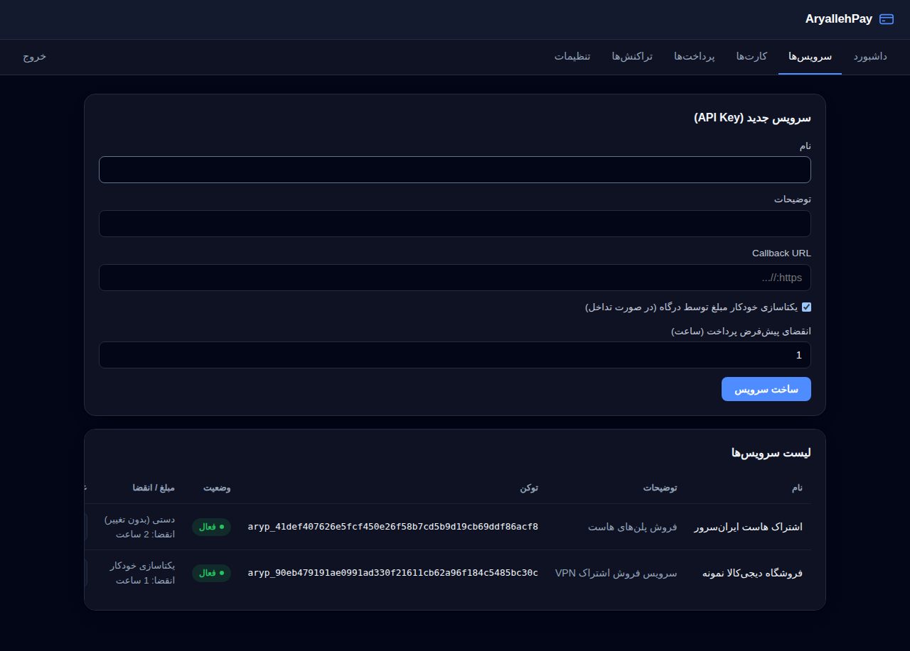
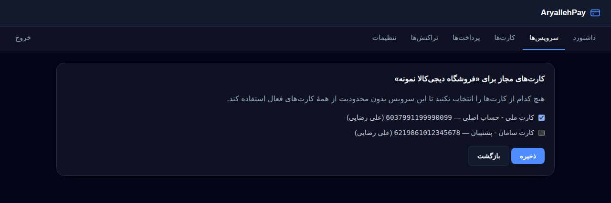
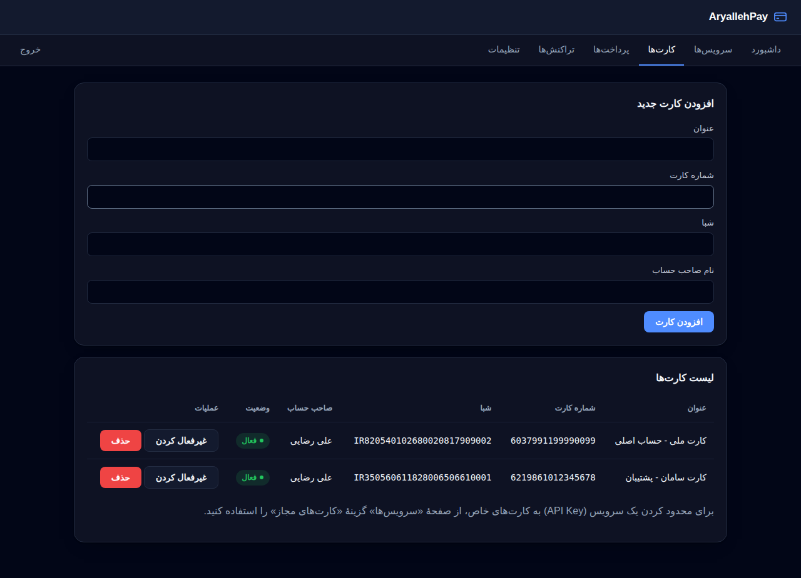
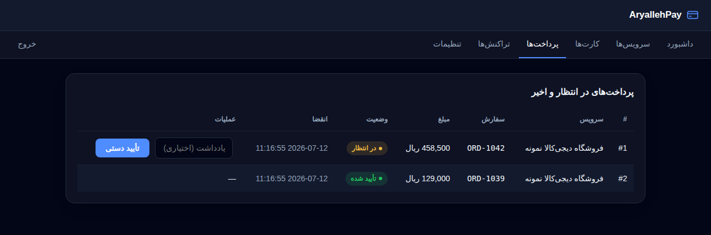
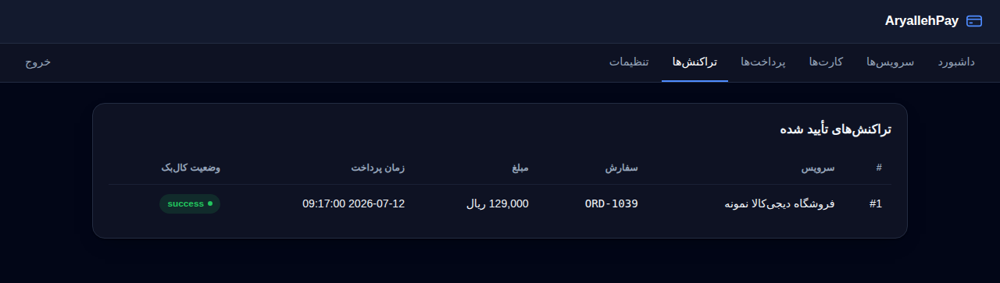
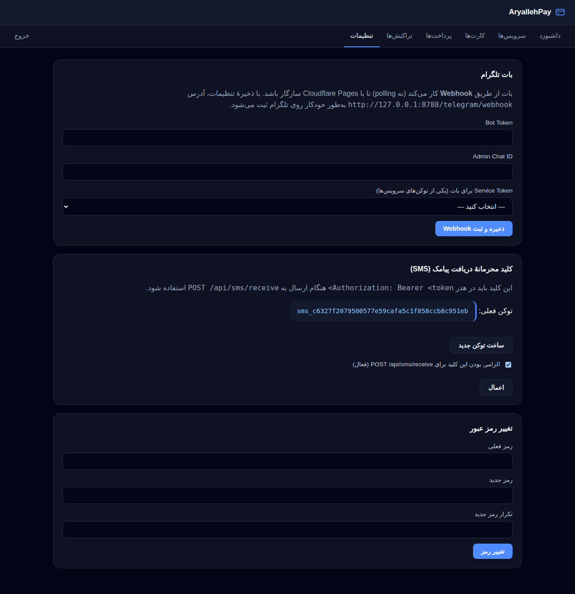
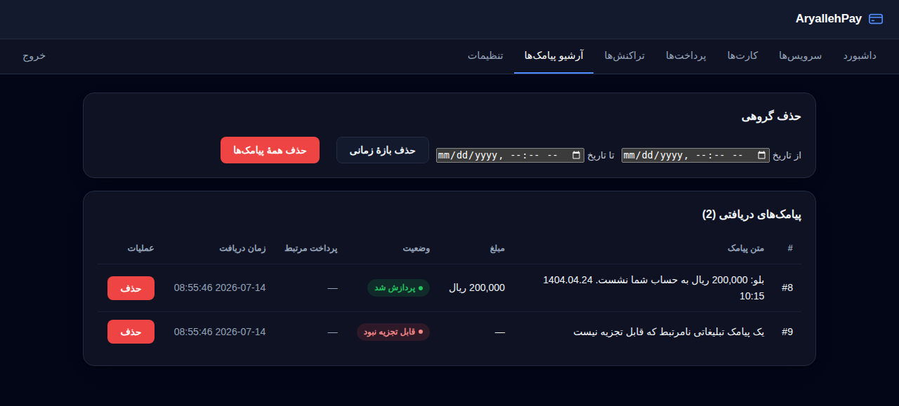
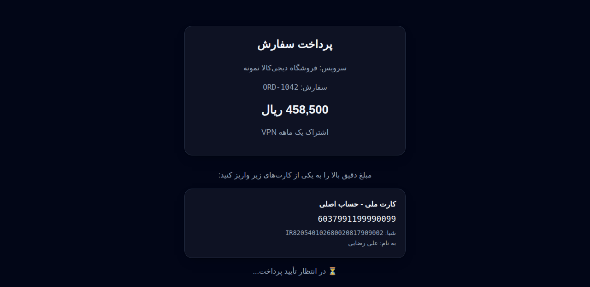

# AryallehPay

پلتفرم مرکزی پرداخت کارت‌به‌کارت بر اساس تحلیل SMS بانکی — نسخهٔ **Cloudflare Pages Functions + D1**.

این نسخه به‌طور کامل روی Cloudflare Pages اجرا می‌شود: بدون سرور دائمی، بدون فایل SQLite محلی، و بات تلگرام از طریق **Webhook** کار می‌کند (نه polling)، چون Pages Functions پردازه یا Thread پایدار پشتیبانی نمی‌کند.

## ویژگی‌های این نسخه

- **کارت‌های مجاز به ازای هر API Key**: هر سرویس (API Key) می‌تواند به زیرمجموعه‌ای مشخص از کارت‌ها محدود شود؛ از پنل → سرویس‌ها → «کارت‌های مجاز». اگر هیچ کارتی برای یک سرویس انتخاب نشود، آن سرویس بدون محدودیت از همهٔ کارت‌های فعال استفاده می‌کند.
- **یکتاسازی مبلغ و انقضای پیش‌فرض به ازای هر سرویس**: از پنل → سرویس‌ها → «تنظیمات مبلغ/انقضا» می‌توانید مشخص کنید که آیا درگاه خودش مبلغ تداخل‌دار را کمی تغییر بدهد تا یکتا شود، یا این مسئولیت با خود سایت فروشنده باشد (و درگاه فقط خطای `amount_conflict` برگرداند)؛ همچنین انقضای پیش‌فرض پرداخت (بر حسب ساعت) را برای زمانی که `expires_minutes` در درخواست فرستاده نشود، تنظیم کنید.
- **تمدید انقضای پرداخت‌های موجود**: تغییر «انقضای پیش‌فرض» یک سرویس فقط روی پرداخت‌های جدید اثر دارد؛ برای پرداخت‌های در انتظار قبلی (حتی اگر منقضی شده باشند) از پنل → پرداخت‌ها، دکمهٔ «تمدید انقضا» را بزنید تا انقضای آن پرداخت مشخص به تعداد ساعت دلخواه از الان تمدید شود و دوباره قابل تطبیق با پیامک شود.
- **تعیین رمز عبور در اولین ورود**: دیگر رمز پیش‌فرضی وجود ندارد؛ اولین بار که به پنل مراجعه می‌کنید، از شما خواسته می‌شود رمز عبور تعیین کنید.
- **کلید محرمانهٔ SMS قابل‌تنظیم**: از پنل → تنظیمات می‌توانید مشخص کنید که آیا `POST /api/sms/receive` به هدر `Authorization: Bearer <sms_token>` نیاز دارد یا نه (پیش‌فرض: نیاز دارد).
- **لیسن تو ال (Listen to all)**: از پنل → تنظیمات می‌توانید فعال کنید که متن هر پیامکی که از طریق `POST /api/sms/receive` می‌رسد — چه پرداختی را تأیید کند، چه مطابقتی پیدا نکند، چه اصلاً قابل تجزیه نباشد — مستقیماً برای ادمین در تلگرام ارسال شود (نیازمند تنظیم بات تلگرام).
- **آرشیو پیامک‌ها**: از پنل → آرشیو پیامک‌ها، تمام پیامک‌های دریافتی (چه تأیید شده، چه نشده) قابل مشاهده‌اند؛ حذف تکی هر پیامک، حذف بر اساس بازهٔ زمانی، و حذف همه به‌صورت یک‌جا پشتیبانی می‌شود. حذف پیامک، تراکنش مرتبط را پاک نمی‌کند — فقط ارجاع آن به متن پیامک خام حذف می‌شود.
- اجرا روی Cloudflare Pages Functions با پایگاه‌دادهٔ D1 (سازگار با SQLite).

## تصاویر رابط کاربری

| ورود | داشبورد |
|---|---|
|  |  |

| سرویس‌ها (API Keys) | کارت‌های مجاز به ازای هر سرویس |
|---|---|
|  |  |

| کارت‌ها | پرداخت‌ها |
|---|---|
|  |  |

| تراکنش‌ها | تنظیمات (بات، کلید SMS، رمز عبور) |
|---|---|
|  |  |

| آرشیو پیامک‌ها |
|---|
|  |

| صفحهٔ پرداخت مشتری | پرداخت موفق |
|---|---|
|  |  |

## راه‌اندازی

```bash
npm install

# ساخت پایگاه‌داده D1 (یک‌بار) — database_id خروجی را در wrangler.toml بگذارید
npm run db:create

# اجرای اسکیمای اولیه
npm run db:migrate:local     # برای توسعهٔ محلی
npm run db:migrate:remote    # برای دیتابیس واقعی روی Cloudflare

# اجرای محلی
npm run dev

# استقرار
npm run deploy
```

پنل وب: `/panel/` — اولین بار که باز می‌کنید، صفحهٔ تعیین رمز عبور نمایش داده می‌شود.

## معماری

| بخش | قبل (Flask) | این نسخه (Cloudflare) |
|-----|-------------|------------------------|
| بک‌اند | Flask + Python thread | Pages Functions (JS) |
| پایگاه‌داده | فایل SQLite محلی | Cloudflare D1 |
| بات تلگرام | polling در Thread جدا | Webhook (`/telegram/webhook`) |
| Session پنل | Flask session امضاشده | کوکی + جدول `admin_sessions` در D1 |

هیچ متغیر محیطی/Secret‌ای در Cloudflare لازم نیست — توکن بات، رمز عبور و کلید SMS همگی از پنل مدیریت تنظیم و در D1 ذخیره می‌شوند؛ فقط باید D1 را طبق دستورات بالا bind کنید.

## Flow

```
سرویس (CrabVPN و...)
  → POST /api/payment/create  (ایجاد سفارش + مبلغ)

بات تلگرام (SMS forwarder، از طریق Webhook)
  → POST /telegram/webhook  (تلگرام پیام را مستقیم به اینجا می‌فرستد)
  → سیستم parse + match می‌کنه
  → callback به سرویس می‌زنه

سرویس
  → GET /api/payment/status/<order_id>  (پولینگ وضعیت)
```

## اتصال پیامک بانکی (اپ اندروید)

برای دریافت پیامک‌های بانکی روی گوشی و ارسال خودکارشان به AryallehPay، اپ اندروید
اختصاصی رو نصب کنید:

- مخزن سورس اپ: **[Aryalleh/aryalleh-pay-apk](https://github.com/Aryalleh/aryalleh-pay-apk)**
- دانلود مستقیم APK: **[⬇️ Aryalleh-pay release](https://github.com/Aryalleh/aryalleh-pay-apk/releases/tag/Aryalleh-pay)**

اپ رو روی گوشی‌ای نصب کنید که پیامک‌های بانکی رو دریافت می‌کنه، و در تنظیمات اپ دو
مقدار زیر رو وارد کنید:

- **آدرس درگاه**: دامنهٔ همین پروژه روی Cloudflare Pages (مثلاً `https://aryalleh-pay.pages.dev`)
- **کلید محرمانهٔ SMS**: از پنل → تنظیمات → «کلید محرمانهٔ دریافت پیامک»

اپ هر پیامک ورودی رو به `POST /api/sms/receive` می‌فرسته (جزئیات کامل در
[docs/API.md](docs/API.md)).

### بانک‌های پشتیبانی‌شده

- بلو بانک
- بانک رسالت (ResalatBank)
- بانک خاورمیانه

## API Reference

مستندات کامل API برای ارتباط بین درگاه و سایت فروشنده (ساخت پرداخت، لینک
فاکتور/چک‌اوت، پولینگ وضعیت، callback و تأیید دستی): **[docs/API.md](docs/API.md)**
